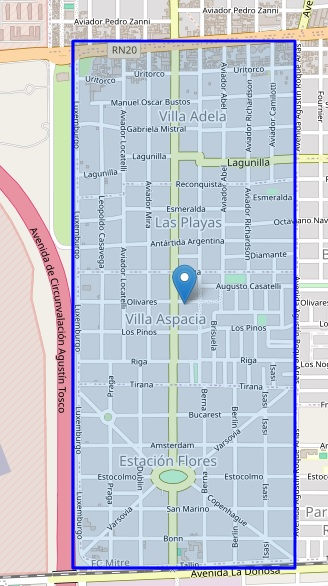
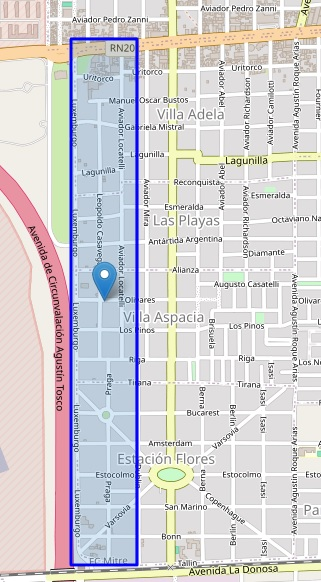
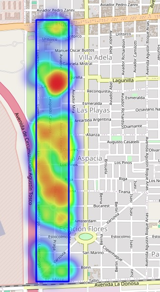
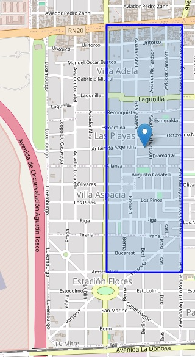
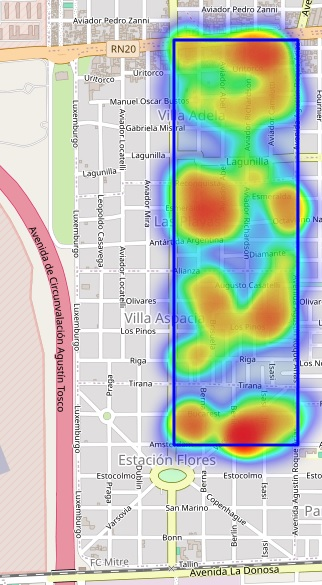
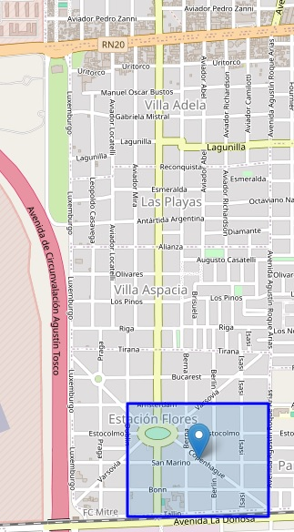
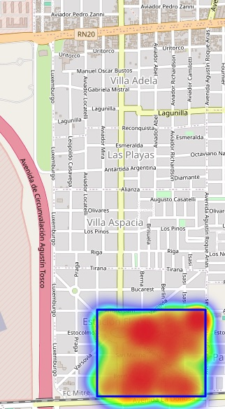

Aquí tienes el texto corregido:

# Resumen Investigación Criminal - Seguridad Pública

Es importante aclarar que, por razones legales, los datos están alterados. Aunque la zona geográfica es real, los datos han sido modificados para:

1. Reflejar la problemática de la zona, sin incluir ubicaciones exactas ni fechas precisas.
2. Omitir la primera parte del ETL, donde aún se incluyen datos sensibles de denunciantes, testigos, direcciones domiciliarias, IDs y otros datos confidenciales.
3. Aunque ya no se hacen referencias a datos específicos, se excluyen las estrategias aplicadas ya que involucran datos sensibles necesarios para las métricas correspondientes.

## Objetivo del Proyecto

Reflejar de manera fiel la investigación real (en la cual participé liderando todos los pasos, incluyendo el seguimiento post-aplicación), para proporcionar una visión esclarecedora sobre:

1. El proceso.
2. Los actores involucrados.
3. El análisis realizado.
4. El enfoque necesario para interpretar este tipo de datos.
5. Qué informar a la junta interdisciplinaria y al público en general.

Además de otros elementos que, sin revelar detalles específicos de la investigación criminal, conforman el resto del proyecto y una propuesta para combatir el delito en una zona específica, con evidencia de su efectividad en la realidad.

## Cuadrante completo donde se realizó la investigación:

El cuadrante tiene 3 sectores donde el delito es sumamente claro. Fuera de estos sectores quedan áreas que realmente no reflejan un problema serio con respecto al promedio de delitos. Además, estos 3 sectores tienen características muy específicas, tanto a nivel de actividad económica como de actividad criminal. 

## División del cuadrante en función de su actividad económica:

### Sector I (Industrial)

Este sector se encuentra completamente colmado por fábricas, depósitos o grandes tiendas de productos de construcción o maquinarias. Es una zona prácticamente sin domicilios particulares, donde los delitos se concentran en 3 ejes:

- Vandalismo
- Hurto
- Robo

Fue difícil identificar la problemática desde el aspecto meramente del dato, ya que, como podemos observar, la distribución (réplica de la situación real) de los hechos no presenta un foco específico.

Esta complejidad se repite en los tres sectores, por eso el abordaje requirió un profundo conocimiento del "delito" como un ente en sí y la interpretación correcta de los datos. Gracias a eso, se logró descifrar cómo el vandalismo era la puerta de ingreso para el resto de delitos, ya que este cumplía una función de "vanguardia" buscando identificar las medidas de seguridad del establecimiento y la respuesta de los cuerpos de emergencias.

### Sector II (Residencial)

La complejidad de este sector radica en que, si bien es una zona netamente de vecinos, estos no se integraron de la manera espontánea que se requiere para la correcta integración. Se realizó una inserción de varios barrios periféricos de la ciudad, ya con conflictos entre ellos, sobre un barrio con su propio ecosistema, propiciando así delitos como:

- Robo
- Robo de vehículos
- Lesiones leves
- Lesiones graves
- Hurto

Si bien el robo, el hurto y el robo de vehículos se dan producto de la concentración de "oferta" por la gran cantidad de personas viviendo en la zona, las lesiones se daban en su enorme mayoría por conflictos entre vecinos, muchos de estos derivados de robos y hurtos entre vecinos. Podríamos decir que era un círculo que se retroalimentaba negativamente. Claro que no la totalidad de los hechos cumplían este patrón, pero sí en su enorme mayoría, llegando a picos donde, si observamos los gráficos en , coinciden por darse todos estos hechos en una temporalidad relativamente corta.

Esto hizo que fueran inútiles las herramientas clásicas por parte de los sistemas de emergencia para combatir esta situación, obligándome a adoptar una estrategia muy diferente (esto con todos los desafíos que implica por el desconocimiento en ese campo y el desconocimiento de los elementos necesarios para evaluar o elementos a tener en cuenta en función del proceso de aplicación), estrategias de "cohesión social", desarrollando dinámicas positivas entre los vecinos (reuniones, eventos deportivos, capacitaciones, festejos nacionales, etc.), buscando así replantear el tejido social de la zona desde intereses en común.

### Sector III (Comercial)

Un sector de alto tránsito de personas y vehículos, donde se concentra tanto la actividad de comercios como de escuelas (tanto jardines, primarias y secundarias), paradas de transportes públicos y una plaza que funciona como centro neurálgico. En horario nocturno no disminuye el tránsito de personas, lo cual propicia hechos tales como:

- Robo
- Robo piraña
- Robo a mano armada

Lo destacable y a su vez el desafío del sector era la búsqueda de golpes rápidos y efectivos por parte de los criminales. De allí el uso de armas o grandes números de personas, para abarcar más víctimas (grupos de escolares, grupos de personas esperando el transporte público, etc.) en el menor tiempo posible y aprovechando la dinámica del tránsito para abandonar la zona.

Esto requirió, contrario al punto anterior, un enfoque más reactivo, con anillos de seguridad dispuestos para activarse cuando ocurriere un hecho, hasta un circuito de patrullaje que acompañe y dé seguimiento a los grupos de peatones, acompañamiento personal de cada negocio en la zona, evitando así la posibilidad de que existan eventos ajenos a la dinámica segura de los locales (negocios que cierran fuera de hora, brechas de seguridad por sucesos accidentales, etc.).

### Aclaración:

La primera instancia de la limpieza de datos se dejó afuera, ya que los datos o variables que se excluyeron eran los datos personales y de identificación de los participantes en las entrevistas. Así, se pasa directamente a la utilización del mapa de calor en función de la cantidad de eventos, para comprender qué observar en esta clase de investigaciones.

Tampoco coincidirán localizaciones con fechas, evitando así hacer referencia a posibles investigaciones en curso, centrándonos en la visión o el enfoque para abordar estos estudios. El proceso de investigación criminal también se deja afuera, ya que revela las herramientas de los investigadores junto con los detalles específicos de las estrategias.
